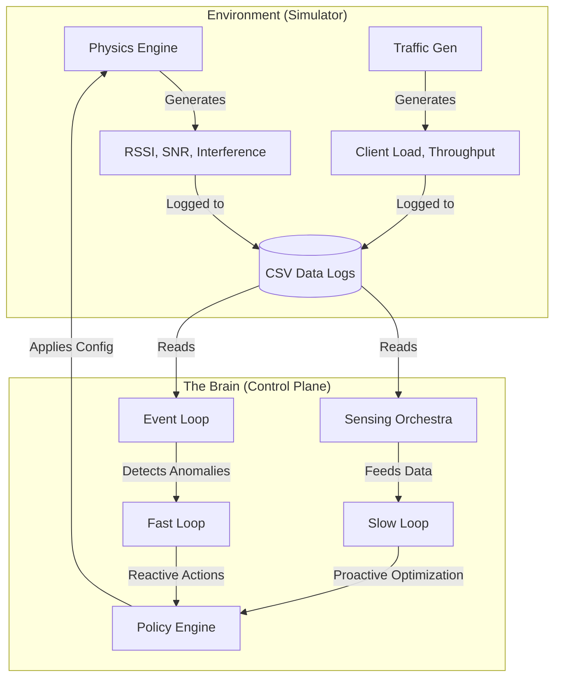
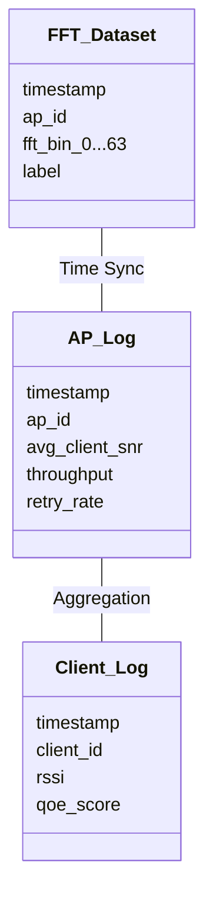

# SpectrumHarmony - RadioResource Management for Arista Netwrorks

> **"Bringing peace and order to the chaotic world of Radio Frequency."**

Welcome to **SpectrumHarmony**. This project is a state-of-the-art simulation and control framework designed to model, analyze, and optimize Wi-Fi networks in complex, multi-floor environments. It is intended for research in AI-driven Radio Resource Management (RRM), Reinforcement Learning–based control, and large-scale wireless system experimentation. 

---

## Table of Contents

* About the Project
* System Architecture
* Key Features
* Getting Started
* Deep Dive: How It Works

  * The Physics Engine
  * The Control Loops
* The Data
* Visualizing Results
* Project Structure
* Contributing

---

## About the Project

SpectrumHarmony simulates a realistic enterprise Wi-Fi ecosystem inside a busy multi-floor building. It models:

* Access Points (APs) serving multiple clients
* Mobile clients with varying traffic demands
* Interference sources such as Bluetooth (BLE), ZigBee, microwaves, and radar

The simulator creates a **digital twin** of the wireless environment and provides a controlled sandbox to design, test, and evaluate intelligent, self-optimizing network control strategies.

---

## System Architecture

The system is divided into two major components:

1. **Environment (Simulator)** – Generates realistic RF conditions and traffic
2. **Control Plane (The Brain)** – Observes the environment and applies optimization policies



---

## Key Features

* **Multi-Floor Simulation**
  Supports realistic simulations across multiple floors and extended time periods.

* **AI-Ready Dataset Generation**
  Produces labeled FFT spectra, telemetry logs, and synchronized network metrics suitable for ML and RL training.

* **Hierarchical Control Loops**

  * **Fast Loop:** Sub-second to second-level reaction to sudden interference
  * **Slow Loop:** Periodic global optimization using graph coloring and Safe RL
  * **Event Loop:** Detection of specific interference signatures and contextual events

* **Deep Observability**
  Tracks SINR, packet error rate, throughput, QoE, and spectral characteristics.

* **Safe Reinforcement Learning Support**
  Designed to integrate constrained and conservative RL methods (e.g., CQL).

---

## Getting Started

### Prerequisites

* Python 3.8 or higher

Install dependencies:

```bash
pip install -r requirements.txt
```

### Running the Simulator

Default run (example: 2 floors, 3 simulated days):

```bash
python simulator.py
```

Custom run:

```bash
python simulator.py --floors 1 --days 1 --scan_period 5.0
```

---

## Deep Dive: How It Works

### The Physics Engine

The simulator uses standard wireless propagation and interference models:

1. **Path Loss**
   Log-distance path loss model
   [
   PL = PL_0 + 10n \log_{10}(d)
   ]

2. **Shadowing**
   Gaussian noise with standard deviation ≈ 3.5 dB to model obstacles.

3. **Interference Modeling**
   SINR is computed based on overlapping channels and active interferers.

---

### The Control Loops

#### Fast Loop (`ControlLoops/fast_loop.py`)

* **Purpose:** Immediate reaction to rapid events
* **Triggers:** Sudden SNR drops, radar detection, burst interference
* **Actions:** DFS channel switch, transmit power adjustment
* **Implementation:** Lightweight RL or heuristics

#### Slow Loop (`ControlLoops/slow_loop.py`)

* **Purpose:** Long-term planning and optimization
* **Triggers:** Periodic execution (e.g., hourly)
* **Actions:** Channel reallocation and power tuning
* **Implementation:** Graph coloring + Safe RL

#### Event Loop (`ControlLoops/event_loop.py`)

* **Purpose:** Pattern and anomaly detection
* **Triggers:** Continuous data monitoring
* **Actions:** Classification of non-Wi-Fi interference sources
* **Implementation:** Signature-based detection using duty cycle, bandwidth, and power

---

## The Data

All outputs are saved in the `data/` directory and are time-synchronized.



| Dataset       | File              | Description                                   |
| ------------- | ----------------- | --------------------------------------------- |
| Spectral View | `fft_dataset.csv` | FFT snapshots for interference classification |
| AP Telemetry  | `ap_log.csv`      | AP-level performance metrics                  |
| Client View   | `client_log.csv`  | Per-client QoE and signal metrics             |

---

## Visualizing Results

Generated plots are saved under:

* `f1_graphs/`
* `f2_graphs/`

Typical visualizations include:

* Throughput vs time
* Interference graphs between APs
* Frequency-domain spectral density heatmaps

ASCII example:

```text
(AP1) -- (AP2)
  |        |
(AP3)    (AP4)
```

---

## Project Structure

```text
RRM-plus/
├── simulator.py
├── ControlLoops/
│   ├── fast_loop.py
│   ├── slow_loop.py
│   └── event_loop.py
├── safe_rl/
├── sensing_orchestra/
├── policy_engine/
├── data/
└── docs/
```

---

## Contributing

Contributions are welcome.

1. Fork the repository
2. Create a feature branch
3. Commit changes with clear messages
4. Push to your branch
5. Open a Pull Request


